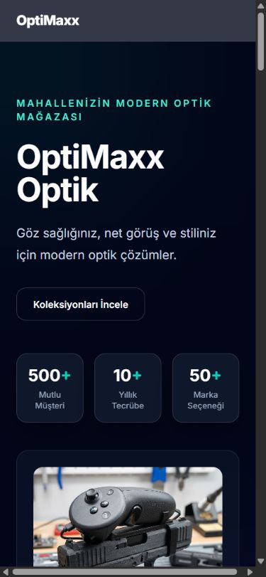
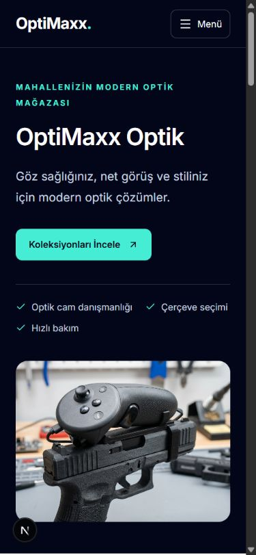

# OptiMaxx frontend review — 7 September 2026

## Scope and environment

Reviewed the public website at https://optimaxx.com.tr with read-only browser interactions, then compared it with the local Next.js 16.2.4 / React 19 frontend and Spring Boot backend. Both Git working trees were clean at the start. Repository ownership was handled with per-command `safe.directory`; global Git configuration was not changed.

The application combines a CMS-driven optical store website, an owner/admin portal, and a staff sales/POS portal. The public site must not expose staff login or appointment links. Existing role checks, authentication cookies, API endpoints, dependencies and hosting configuration were retained. No deployment or production writes were performed.

The frontend ran at http://127.0.0.1:3000. The unchanged backend ran at http://127.0.0.1:8080 against a temporary in-memory H2 database in PostgreSQL compatibility mode, using an already cached driver. PostgreSQL, Redis and ClickHouse were not available locally. This is a functional test environment, not a production infrastructure equivalence test. Publicly published CMS blocks were copied by GET from the live public API into this isolated local CMS for a like-for-like content comparison. Customer/repair fixtures were created only locally.

## Important findings and changes

- **Public navigation:** the live mobile header had no navigation. Added a keyboard-accessible mobile disclosure menu, Escape handling, a skip link, native fragment navigation and sticky-header offsets. Navigation is derived from enabled CMS sections; absent destinations are excluded from section actions.
- **Public layout:** retained the navy/teal identity while improving hierarchy, spacing, service/product cards and visit/contact information. Replaced moving, duplicated brand cards with a responsive grid and the existing accessible dialog primitive. Removed hard-coded customer/experience counters and non-CMS promotional sections. The homepage no longer imports GSAP or Lenis for scrolling or visibility.
- **Content and failures:** removed local demonstration-data fallback. Failed CMS requests now produce an explicit retry state, empty publications produce an empty state, and requests have an eight-second timeout. Added a loading state and payload validation. Genuine published content and images remain sourced from the API.
- **Maps and contact:** the deployed external map link encoded an entire iframe as a search query; local code already partially handled iframe sources, confirming deployment divergence. Shared parsing now extracts a Google Maps source safely without inserting raw HTML and rejects executable or non-Google embeds. Phone/email details are actionable links. The actual map rendered in the local mobile browser.
- **Authentication:** HTTP 403 no longer triggers token refresh/logout. Concurrent 401 responses share one refresh; each request retries at most once. Existing session storage and backend authorization remain in place. API requests now have a 15-second timeout.
- **Dialogs and menus:** fixed dialog title/description semantics and close-button labels. Brand and password-reset dialogs trap focus, close with Escape and restore trigger focus. The account menu uses the existing menu primitive, fits mobile viewports, opens below the sales header, and shows administrative links only to OWNER/ADMIN. Browser-verified and fixed hydration mismatches in persisted account display, the live clock and nested paragraph markup.
- **Management tables:** paginated APIs no longer silently appear complete after the first 200 records. The UI explicitly states that search/filtering applies to loaded records and lets users load subsequent batches. Fixed prematurely truncated filter options, added search/filter/page-size labels and sort semantics, and confined horizontal scrolling to the table. Detail responses cannot reopen a dismissed detail panel; mutation guards prevent simultaneous submissions. Mutation success still refreshes the real API data.
- **Contract mismatches:** repairs now require the fields actually required by the backend; edit mode submits only a valid repair status. Repair table fields use `customerId` and `receivedAt`, matching the DTO, and status values are translated. The audit table now reads `action` instead of nonexistent `eventType`.
- **Truthful notifications:** replaced fabricated low-stock fallback records with a real query, loading/error/empty states and retry. Removed the sales header's hard-coded three-notification badge; it had no real data source.

## Verification

| Check | Result |
| --- | --- |
| `npm run build` | Passed; production compilation, TypeScript and route generation succeeded. |
| `npm run typecheck` | Passed. |
| ESLint on changed TypeScript files and new tests | Passed, zero warnings/errors. |
| `npm test` | 15 tests passed: refresh concurrency/retry limits, 403 handling, safe links/maps, CMS validation, failed/invalid/empty/successful API responses. |
| Backend `mvnw.cmd -q test` | 130 tests passed, zero failures/errors/skips. |
| `git diff --check` | Passed after whitespace cleanup. |
| Full-project `npm run lint` | Still fails: 20 errors and 7 warnings in unchanged files; see `lint-current.txt`. |

Browser checks completed:

- Live homepage at desktop and 390px mobile sizes, including navigation and map-link inspection. No console error was captured in that live visit; this does not prove all production API paths are healthy.
- Local homepage at 390px, 768px and 1440px. No horizontal document overflow in those checks. Final desktop inspection: one main landmark, zero broken loaded images, no missing fragment destinations and no captured console warning/error.
- Mobile menu → contact: menu closed, URL fragment updated, target remained below the sticky header. Google map loaded; phone/email destinations matched CMS values.
- Brand dialog: Tab remained inside, Escape closed it, and focus returned to the selected card.
- Empty login form: required-field messages appeared. Real local owner login, mobile account menu and logout completed.
- Password-reset dialog: mobile layout, field label, initial focus, Escape and trigger focus restoration. Email sending was not exercised.
- Repair creation through the browser, status change to IN_PROGRESS through the browser and successful refreshed table response. The completed record remained in the isolated local backend.
- Audit pagination: 212 records, initially 200 loaded; “load more” fetched the remainder, removed the notice and displayed a 212-record count. Search for the local repair type returned the matching audit entry. Mobile table scrolling stayed inside its container.
- A fresh local audit/repair browser session no longer reported the hydration errors found earlier.

## Limits and remaining work

- Full lint remains blocked by older issues in inventory, analytics/command components, POS and animation/theme utilities. This review did not suppress those rules or claim the entire repository is lint-clean.
- Full POS checkout/refund/invoice, prescriptions, staff-role browser sessions, and every administrative CRUD path were not exercised end to end. Existing backend tests passed, but they do not replace those browser tests.
- No authenticated production session was used. No live record was created, updated or deleted and no live message was sent.
- PostgreSQL migrations, Redis-backed limits, ClickHouse delivery, production Heroku routing and email delivery were not validated against real infrastructure.
- Browser simulation of an unavailable API could not be completed: automatic command review rejected both attempts to start a second local frontend against an unavailable local API, with only “blocked by policy” returned. Failure handling is covered by unit tests; its final browser rendering remains unverified.
- The live CMS currently includes a hero image unrelated to optical products, example-looking contact details and generic social-platform links. Those published values were preserved rather than replaced with invented business information; the owner should verify them in the CMS before deployment.
- Customer and transaction-type ID entry in the repair creation form remains an existing usability limitation; no speculative backend lookup contract was introduced.

## Screenshots

The mobile before/after images use the same 390px viewport and the same published CMS content. Before is production; after is the local code. They are not evidence that the deployed and local binaries were identical.

| Before: live | After: local |
| --- | --- |
|  |  |

Additional verified captures: `after-local-desktop.png`, `after-local-contact-mobile.png`, `after-local-account-mobile.png`. A full-page browser capture showed stitching artifacts and is not used as verification evidence.

The local development servers were left available for review. The temporary backend data lives only for the Java process lifetime; no backend source, database schema migration or deployment configuration was changed.
